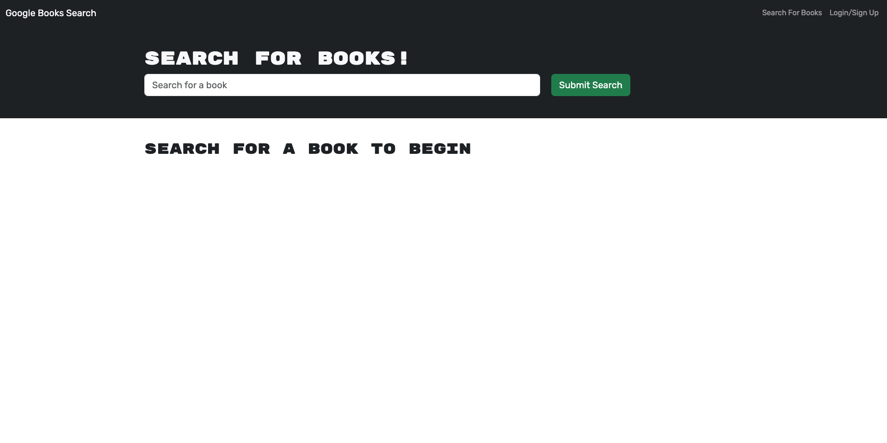

# MERN-SLEUTH: Google Books Search Engine

## 

## Description

This simple website uses the MERN stack: a MongoDB database, a React front end, and a Node.js/Express.js server/API.

It is a website which allows users to search for books via the Google Books API. If a user signs up and logs in, they can save books. The saved books are stored in persistent storage, in the back end, associated with their username.

To create this application, I was given a starter code: a fully functional version of the app that used a RESTful API. My task was to refactor the RESTful API, converting it to be a GraphQL API built with Apollo Server.

The application was built/deployed using Render.

### Technologies

- MERN stack
- MongoDB
- React
- Express.js
- Node.js
- GraphQL
- Apollo Server
- JWT (JSON Web Token)
- Render
- GitHub
- JavaScript, HTML, CSS

### Skills/Concepts

- Refactor a RESTful API MERN stack application to be used with a GraphQL API
- Use of GraphQL's typeDefs and resolvers to define queries and mutations
- Use of GraphQL syntax
- Use Render to build/deploy the site

## Table of Contents

- [Installation](#installation)
- [Usage](#usage)
- [Contributions](#contributions)
- [License](#license)

## Installation

Visit the GitHub repo here: [REPO](https://github.com/danrcross/mern-sleuth)

Visit the deployed site here: [SITE](https://mern-sleuth.onrender.com/)

## Usage

## License

This application is covered under the [MIT](https://opensource.org/licenses/MIT) license.

## Contributions

Starter code from coding-boot-camp: [STARTER CODE](https://github.com/coding-boot-camp/solid-broccoli)

## Tests

No tests used for the development of this app!

## Questions

Any Questions? Click a link below to visit my GitHub and/or email me!

For emails, please use this format in the subject line: 'GitHub: {NAME_OF_REPOSITORY}'

[GitHub](https://github.com/danrcross)

[Email](mailto:danrcross@gmail.com)
